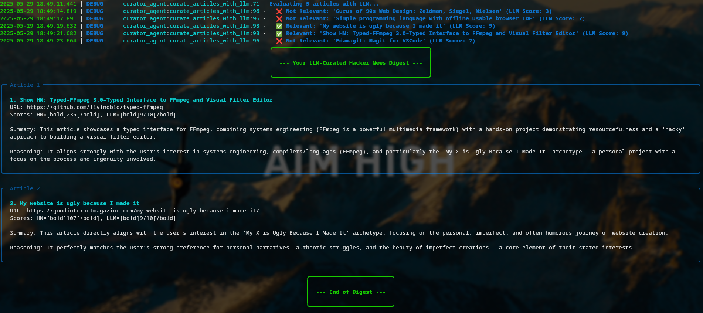

# HN_Curator

A simple HackerNews curator.

Simply define your preferences in the `config.py` and specify how many articles you want to choose from.
Sit back and read as the program generates a curated digest for you on the CLI.

### Usage
`python3 main.py --cli-digest`

